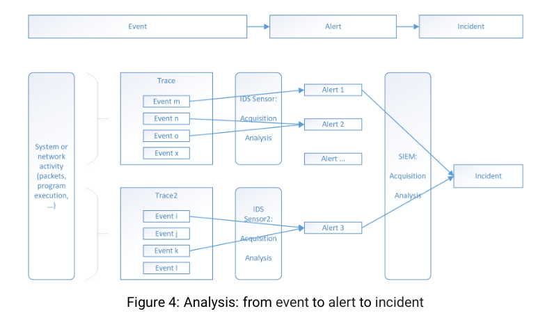

### SOIM (Secuirty Operation and Incident Management) = ID/P/S + SIEM + SOAR

Wannacry = EnternalyBlu(Smb) + ransonware
proactive vs active
downtime restrictions
Mitigation plan

Risk Exposure == risk
SIEM 
SOAR
system log files && application log files
CTI 
ISAC 
CERT && ISAC trusted organizaiotns
SOC (security operation center)
libpcap tcmdump
promicuous mode
PCAP:
- Volume
- Packet Size
- Segmentation and Fragmentation
- Timestaps
- MAC Layer interpretation (ARP posoinig)
- Application Layer interpretation 
- Encryption (HSM, WAF(Weeb Applcation Firewall, Application Layer) while IDPS are in network)

Network aggregates: NETFLOW/IPFix (tool)

SPAN (Switched Port Analyzer) – Cisco Terminology
- Also called Port Mirroring (generic term).

Network TAP (Test Access Point)
- Hardware-based (unlike SPAN, which is software-based).

DNSSEC := DNS + authenticaion
unsolicited := not asked

auth.log
pam
CLF and ECLF := proxy and web serer log 
Kernal(Harware) vs Sytem logs(Services)

Orange Book

Audit Trail

Endpoint Protection := antivirus engine
Syslog: UDP/513
- Timestamp
- Hostname
- Process (string)
- Priority (0,7)
- PID (int)
- Message

var/log/

Elasticsearch-Kibana-Logstash

acquisition := obtain buy

Misuse detection(i know how wrong looks)
- signatures
Tainting (Dynamic Taint Analysis) = Track malicious data flows.
Haystak, Nides 
`Snort` -> YARA

Anomaly Deteciion (i only know what normal looks, 0-day detection)
- Specification vs Learning

FP  I -> Soundess
FN  II -> Complete
Precision := if and AI fond an atack how much do i accpect to be right
Recall := from all positives what it could have gotten how many did ti get
MSSP Settings (Managed Security Service Provider Configurations)

Alerr messages := Schema + Ecnoding + Transport Protocol = (CEF, LEEF, CIM, CADF)

Syslog RFC 5424 UDP
DMTF

Alert Correlation
- betwenen alerts 
- alters and evn
- altermn and exter
- incidnet infromation echagne

ELK (stack)

APT (Advaced Persistent Thread)

SOC --outsource--> MSSP
ISI -> ETSI

WAF and SBC
IP Ingress/Egress Filtering
atuomated remeidation -> automated avoidance
DDOS solve using MPLS
SDN
change-control ticketing systems
Attack Trees
Attack graphs
Site Reliability Engineering

CVE CVSS Nist National Vunrability Database
CWE - Computer Emergency Response Team
CAPAC ATT&CK

Honeypots
- IoC
- sensitive data example
Slamemr - Worm
MISP

signatures + generalize ⟹ IoC
ISAC
YARA
Cyber Situational Awareness (CyberSA) is the ability to perceive, comprehend, and project the current state and potential future state of the cyber environment, including threats, vulnerabilities, and operational impacts, to enable timely and effective decision-making.

EU nis directive
Basel II Sarbases-Oxley
A National CERT (Computer Emergency Response Team),
CISO (Chief Information Security Officer).
CSIRT (cyber sec incident reponse team)

>  IoCs := Indicators of Compromise.

BSD syslog (RFC3164 - RFC5424)
Documents the status - document the existing one

ssylog -> /dev/log --syslog deamon--> /var/log/syslog

Replay Resistance TLS + new syslog. SDATA filed of syslog
CLF (Common Log Format)
WELF

NetFlow / IPFIX (NetFlow v10)

##### ELK = elasticsearch, logstash, kibana
- logstash collect different from differnt sources with diff formats --- feeds ---> elestisearch
- eleasticsearch does a distributed search in the indexed distributed data 
    - Sharding and replica support NoSQL
- kibana - rest apis elasticserarh the data and then visualizations
Extra:
- Bits
Alternative:
- lostash - fluentd
- bits - fluendbit

##### SIEM (Security Information and Event Management) is a sophisticated software solution and set of processes
- detect security threats suspicious activities in real-time
- facilitate incident response
- compliance requirements

