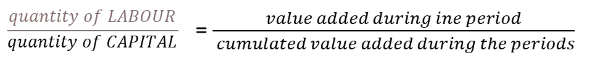
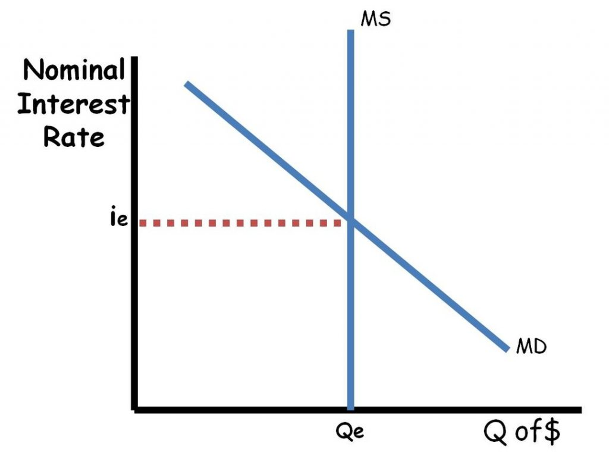

```
# ---Rosier Model General--- 
# c = L/M = 24
# dM = dL - SB  
# dL = qL0  q=groath rate -> L1 = (1+q)L0
# SB = (1-d)rL0
#--Cases--
# dM = qM0  q=groath rate if c is const  
# M1=0   minumum for general crices

q=-0.05/(1/24-1+0.05)

#----------------------------------------
# SB = 0.04L0
# M1=0
# q=?
r = 0.08
# M1-M0 = dL - 0.04L0   /L0
# M0 = L0/24
# 0 = L0/24 + qL0 - 0.04L0
q = -(1/24 - 0.04)


#-----------------------------------------
#qM0 = qL0 - 0.04L0   /L0
# q(1/24) = q - 0.04
# q(1/24 -1)=-0.04
q = -0.04/(1/24-1)


# ----Ecxess Supply----
# P1 = R - C
# C1 = W1 + I0
# R1 = C1+I1 = W1+I1
# P1 = I1-I0
E0 = 1779
I0 = 0.2*E0
p = 0.13
# p = P1/TC1 = (I1-I0)/(W1 + I0)
# I1-p(W1)=p(I0)+I0
# 0.2E1-p0.8E1 
E1 = (p*I0+I0)/(0.2-p*0.8)
```


An Inquiry into the Nature and Causes of the Wealth of Nations" (1776).
From this title, Adam Smith's definition of economics is essentially:
The study of how wealth is created and distributed within a nation.

# Acconting 
The wealth is a "liability" of the entity to its itself. This is what makes the two sides balance.

# Leontief Model
```
R=[0.3, 0.4; 0.2, 0.7]
I=[1, 0; 0, 1]
v=[100, 200]
# q=Rq+v -> q=(I-R)^-1*v
q=inv(I-R)*v
# TB=Ex-Im=0-dIm
# Im=m*q
m=[1,2]
Im0=m*q

v1=1.10*v
q2=inv(I-R)*v1
Im1=m*q2
TB=Im0-Im1

v1=[100,220]
q2=inv(I-R)*v1
Im1=m*q2
TB=Im0-Im1
```
Total Output (q) = Intermediate Use (Rq) + Final Use (v)
TB = Exports (X) - Imports (M)
| Feature | Source-Use Balance | Price-Cost Balance |
| :--- | :--- | :--- |
| **Equation** | `q = Rq + v` | `p = pR + h` |
| **Main Focus** | **Quantities** (Physical Flow) | **Prices** (Value Flow) |
| **It Balances...** | Total Output = Intermediate Use + Final Use | Price = Intermediate Cost + Value Added |
| **It Answers...** | "How much total output do we need for a given final demand?" | "How do input costs and value added determine final prices?" |
| **Key Variable** | `v` (Final Demand) drives the system. | `h` (Value Added) drives the system. |
| **Unit of Account** | Physical units (tons, pieces, etc.) | Monetary units per physical unit ($/ton, €/piece) |
| **Simple Analogy** | **Where the stuff goes.** | **Where the money goes.** |
# Keynesian Model
Gross Domestic Product (GDP) is the total market value of all 
 - final goods and services produced 
 - within a country's borders in a 
 - specific period of time.

> GDP = C + I + G + NX
- C = Consumption (household spending)
- I = Investment (business spending on capital, new homes, and inventories)
- G = Government Spending (on goods, services, and employee salaries)
- NX = Net Exports (Exports - Imports)

everything produced in market value in a given period

P = CI + C + I
CI := company byes from company but it is immediately used.
I := compnay byes from company but ti will be used later.
C := the final product consumed by the consumer
- Savers (Lenders):
    - Who they are: Primarily households, but also firms with retained earnings or even the government if it runs a budget surplus.
    - What they do: They earn income (Y) and spend only a portion of it on consumption (C). The leftover amount is their saving (S).
    - Their Goal: They don't want their savings to just sit idle. They want to put their money somewhere safe where it can earn a return (interest, dividends, etc.). They become lenders by depositing money in a bank, buying a bond, or buying stock.
- Investors (Borrowers):
    - Who they are: Primarily firms (businesses).
    - What they do: They want to undertake physical investment (I)—build new factories, buy new machines, etc. They believe these projects will be profitable in the future.
    - Their Problem: They often don't have enough of their own cash on hand to pay for these large projects. They need to acquire funds from others. They become borrowers.

GDP = Y = Total Demand (AD) = C + I = $c'Y+C_0+I$

So the idea of this formula is that if you inject some money in the economy people will start spending more so the demand increased => gdb increases.
"If you inject some money in the economy...": This is the initial, autonomous spending increase (dG, dC₀, or dI). It's the "stone in the pond."
"...people will start spending more...": This is the key behavioral assumption. The people who receive the initial injection as income will then spend a fraction (c') of it. This is the first ripple.
"...so the demand increased => gdp increases.": That new spending becomes income for a second group of people, who then spend a fraction of it, and so on. The sum of all these rounds of spending is the total increase in Demand, which by definition is the total increase in GDP (dY).

So in a sence this is like summing up every time you reuse the money before it leakes out becase or savings

Keynesian view: prices rise less than incomes (prices are sticy, they need time to adjust), 
therefore increased demand (in Ft) implies also increased production (physical quantity).

But increase in production can only happen if you have people to employ and machines to be used
so you have to inject money in th economy during a resesion.

The economy is efficient and already producing as much as it can. An increase in demand can't create more stuff, 
so it just creates inflation.
New classical view: the increased demand (in Ft) is satisfied at higher
prices, the production does not increase.

The Keynesian view  -> during recession happens because prices are sticky and you have unemployment so you can expand the production.
New classical view -> this happens during an efficient economy.
The whole difference is made during the short and long term.
I mean these views are not like different views but complementary.


Instead, the equilibrium I = S(Y) means: 
The decision to invest (I) must equal the result of savings (S), 
which itself is a result of the level of income (Y). 
The economy adjusts its income level (Y) until the amount of savings that 
results is exactly equal to the amount of investment that businesses have decided to undertake.
you cant have I(Y) because I C are decides while S is redidue

Paradox of thrift (widow’s cruse)
It is not saving that determines investment, but the other way round!

I = S(Y) this is just saying that that S(Y) lages behind I.
You can not have and effect is S you only effect I.
=> change I => after the lag  S(Y) levels of to the same level of I.

lag here is the time it takes for the multipler effect to take place
ΔI → ΔY → ΔS

durable unemployment" means persistent, long-lasting unemployment that the economy cannot fix on its own

But Keynes showed that in a recession, the excess supply of labor is offset by an excess demand for money.

π = (New Price Level - Old Price Level) / Old Price Level


# Karl Marx
K -> M -> C -> P(C, L) -> C' -> M' -> K + S -> K'
if L does noe expacnd the L/K is decresion ⟹ pr = S/(K+L) tendency to decreas.
Therefore we have to find labor outside the contry to make L/K a const.

Labor Power
- Labor is the actual activity of working—the expenditure of physical and mental energy over time. It is the process of creating value.
- Labor Power (Arbeitskraft) is the commodity that the worker sells. It is their capacity or ability to perform labor for a specific period (e.g., for an hour, a day, or a week).
⟹ Wage Labor
> CAPITAL: liabilities (wealth) used with chrematistic aim
# Genearl Equilibrium Theory (Orthodix Theory) C-C' 
- Money is used but it just face value its completely exchanged
- Adam Smith Lean Walras
- `Contributions`: This refers to the positive value that an individual or firm adds to the economy through productive activity.
    - It's your work, your innovation, the crops you grow, the goods you manufacture.
    - It is the wealth you create.
    - In a simple sense, it's what you give to society.
- `Appropriations`: This refers to the wealth that an individual or firm takes from the economy, often without having created equivalent value.
    - It's the wealth you extract or claim.
    - It is what you take from society.
Contributions = Appropritations

# Keynes C-M-C'
- Here money it's an asset which can be hold (savings) => another market for money
The "price" of holding money is the interest rate (i) you give up by not holding an interest-bearing asset (like a bond).



$$\text{(Excess Demand for Goods) + (Excess Demand for Labor) + (Excess Demand for Money) = 0}$$
The GE doesnt take care fo this last part `Exess Demand of Money`

# Silvio Gesell
From my understanding it is the same as where Keynes lives in a different nature of individual and social wealth, but I am not sure about this. I mean in Gesell's theory money is still an asset on one side and a liability on the other side so it cancels out in social wealth (sum of indiv.) different from ORTHODOX where money is just a value of the exchange rate, but the part if it is OKINOMIA or KHREMASTISTIKE I don't know how to prove this.
The thing I am going with is that by making land should be rented to the government and making the money lose value over time you are turning both land and money into commodities. In other words Gesell tried to break the K-M-C-P(C,L)-C'-M'-K'  where M<M' (P is production here, L labor, and K is capital) by making both  M and (K=C+Land which doest devalue, i mean here machines devalue they get old while land does not) to be devalued over time (here the land is rented so it cost more and more every time this can be though as being devalued) so he can turn this KREMASTISTIK process to an OIKONOMIC one.
I may be very wrong. This is just what I understand.

## Rosier Model

$ΔM_t = ΔL_t - SB_t = ΔFL_t - SB_t$ ⟹ stock and flow of money always increasing
⟹ $M/L \not → 0$
$L_t - M_T := net debt$

Both money and dept must grow but dept should grow faster to keep the economiy going.

If you can not cover for the money leacakge aka banks saving
⟹ General Crisis

## Capitalism && Kornai
- Capitalist Crisis: "We have too much stuff we can't sell, so we must fire people." The problem is a surplus of goods and a deficit of profitable demand.
- Socialist Crisis: "We can't produce enough stuff, so the queues are getting longer." The problem is a shortage of goods and a surplus of desperate demand.
Hard budget constraint
systemic excess supply
The Winning Strategy is Availabil
- The Chrematistic Goal (M-C-M'): The survival of a firm depends on successfully converting its initial capital (M) into a commodity (C) and then selling that commodity for more money (M'). The sale is the point of existential crisis for the firm.
- The Environment is Competition: A firm is never alone. Other firms are also trying to complete their own M-C-M' circuits, targeting the same pool of customer money.
- The Fear of the Unsold Commodity: A firm's greatest fear is being stuck with its commodity (C). Unsold goods represent a failed M-C-M' circuit and a financial loss that can lead to bankruptcy (Kornai's "hard budget constraint").
- The Winning Strategy is Availability: In a competitive market, the surest way to beat a rival is to be ready when they are not. This means having the product on the shelf, the car on the lot, the service ready to go. The customer must be served instantly.
- The Logical Consequence is Excess Supply: To ensure instant availability and never lose a sale to a competitor, every firm must plan for a surplus. It must have more inventory than it expects to sell. When all firms do this, the entire economic system becomes characterized by a chronic, structural surplus.

M_available < P_total
C_total < C_total + π_planned

Chremastictic Economy -> groth imperative -> excess supply sytem.

Excess Supply

CHREMATISTIC (Capitalist) MODE OF PRODUCTION ON MICRO LEVEL
- intensive capital use
- division of labor -> instensive capital use
- intensive capital use -> more money -> lower price -> market concentration
- wage labor is scalable 
- if all wage labor -> innovation (big because of market conentration and scalabel labor)
- apply innovation -> money -> those who have money will make more money because they can invest 
and implement inovation -> capital concentration

MACRO level
- Division of Labor you will have higher income 
- for innovation -> you need money -> capital concentration -> Money power is central

So INOVATION is key
 - Countries/companies at the top of the pyramid earn the highest profits.
 - They accumulate massive amounts of capital ("money power").
 - They use this capital to fund the next wave of innovation.
 - This innovation allows them to stay at the top of the pyramid.
Meanwhile countries at the bottom earn low incomes, fail to accumulate enough capital to fund major innovation, and thus get "stuck" in the lower-value stages of production. This explains why global inequality can be so persistent.
