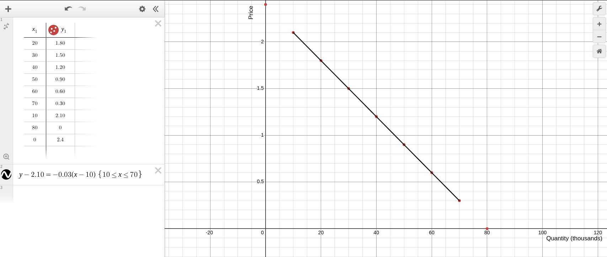
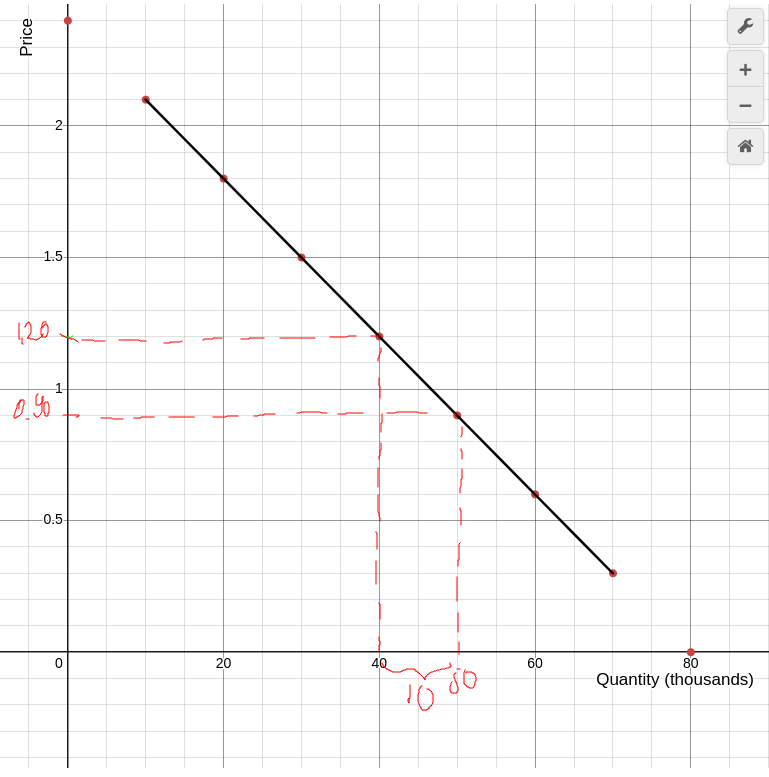
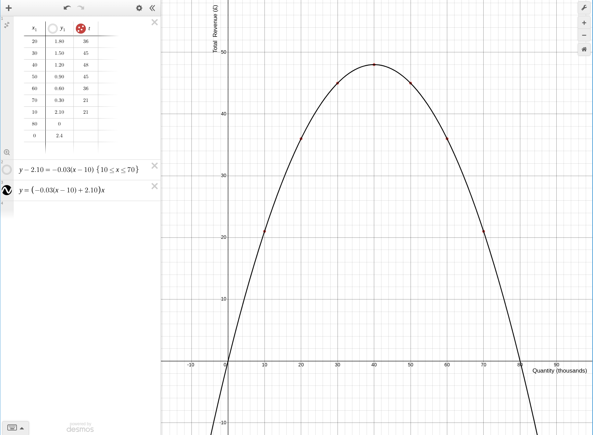
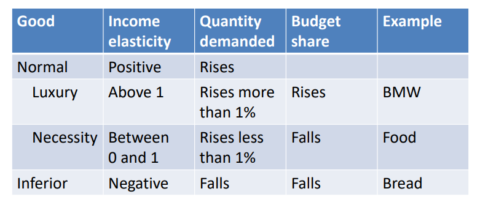

# Homework3
## 1
Note: everywhere here ϵ means elasticity of demand
a.
$m = \frac{y_2 - y_1}{x_2 - x_1}$
$m = \frac{1.80 - 2.10}{20 - 10}$
$m = \frac{-0.30}{10}$
$m = -0.03$
$y - 2.10 = -0.03(x - 10)$
$y = -0.03x + 0.30 + 2.10$
$y = -0.03x + 2.40$
$Q(P) = -0.03P + 2.40$

Not written in the plot but Price is in £.

b.
£1.20 - £0.30 = £0.90
50,000 - 40,000 = 10,000
Not written in the plot but Price is in £.

c.
Total Spending (£ Thousands) = Quantity (Thousands)* Price (£) 

| Price (£) | Quantity (Thousands) | Total Spending (£ Thousands) |
|-----------|----------------------|--------------------------------|
| 2.10      | 10                   | 21                             |
| 1.80      | 20                   | 36                             |
| 1.50      | 30                   | 45                             |
| 1.20      | 40                   | 48                             |
| 0.90      | 50                   | 45                             |
| 0.60      | 60                   | 36                             |
| 0.30      | 70                   | 21                             |

d.
$\epsilon = \frac{\Delta q \%}{\Delta p \%} = \frac{(\Delta q / q)}{(\Delta p / p)} = \frac{\Delta q}{\Delta p} \frac{p}{q} = m^{-1}\frac{p}{q}$
or
$\epsilon = = \frac{\delta q}{\delta p} \frac{p}{q} = m^{-1}\frac{p}{q}$

| Price (£) | Quantity (Thousands) | Total Spending (£ Thousands) |  Own Price Elasticity of Demand |
|-----------|----------------------|--------------------------------|---------------------------|
| 2.10      | 10                   | 21                             | -7                          |
| 1.80      | 20                   | 36                             | -3                          |
| 1.50      | 30                   | 45                             | -1.67                       |
| 1.20      | 40                   | 48                             | -1                          |
| 0.90      | 50                   | 45                             | -0.6                        |
| 0.60      | 60                   | 36                             | -0.33                       |
| 0.30      | 70                   | 21                             | -0.14                       |

e.
$Total Revenue = Q(P)*P = (-0.03P + 2.40)P$
Degree of polynomial is 2 so we get a quadratic curve.

f.
From the grapth and table above you can see that the peek is at 48.
or
$dy/dx = d(-0.03x² + 2.40x) / dx$
$dy/dx = -0.03 * 2x + 2.40$
$dy/dx = -0.06x + 2.40$
$-0.06x + 2.40 = 0$
$-0.06x = -2.40$
$x = -2.40 / -0.06$
$x = 40 ⟹ y = 48$

So for price 1.2£ revue was the highest. You can read from table also.

g.
1.2£ (you can't gain more revenue then this ⟹ -1 elasticity)

b.
$|ϵ|>1$ elastic ⟹ P = [2.1, 1.8, 1.5] £  or  $1.2 < p <= 2.1$
$|ϵ|=1$ unit-elastic ⟹ P = [1.2] £ 
$|ϵ|<1$ inelastic ⟹ P = [0.9, 0.6, 0.3] £ or $0.3 <= p < 1.2$

## 3
a. b. c. d.

$ϵ_i =\frac{ΔQ\%}{\Delta I\%}$ I- for income
Assuming the prices are constant ⟹ 
$ϵ_i =\frac{ΔE\%}{\Delta I\%}$ E- for expenditure
Proof:
$E = Q \cdot P \implies \frac{E}{P} = Q \implies \Delta Q\% = \frac{\Delta Q}{Q} \stackrel{P \text{ is constant}}{=} \frac{1}{P} \frac{(E_1 - E_2)}{(E/P)} = \frac{\Delta E}{E} = \Delta E\%$

| Good  | Income (Year 1) | Income (Year 2) | Budget Share (Year 1) | Budget Share (Year 2) | Income Elasticity (\(E_i\)) | Normal/Inferior | Luxury/Necessity |  
|-------|------------------|------------------|------------------------|-------------------------|-----------------------------|------------------|-------------------|  
| GoodA | £30             | £50             | 0.30                   | 0.25                    | 0.67                        | Normal           | Necessity         |  
| GoodB | £30             | £70             | 0.30                   | 0.35                    | 1.33                        | Normal           | Luxury            |  
| GoodC | £25             | £20             | 0.25                   | 0.10                    | -0.2                        | Inferior         | Neither           |  
| GoodD | £15             | £60             | 0.15                   | 0.30                    | 3.0                         | Normal           | Luxury            |  

