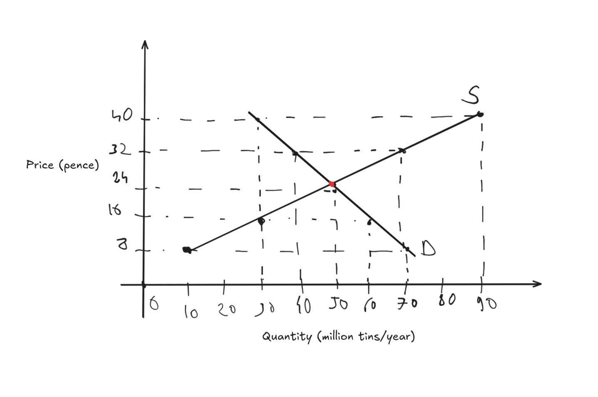
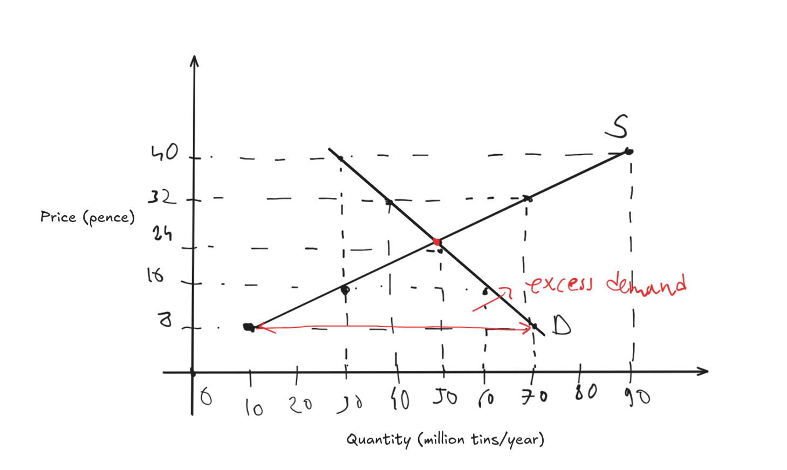
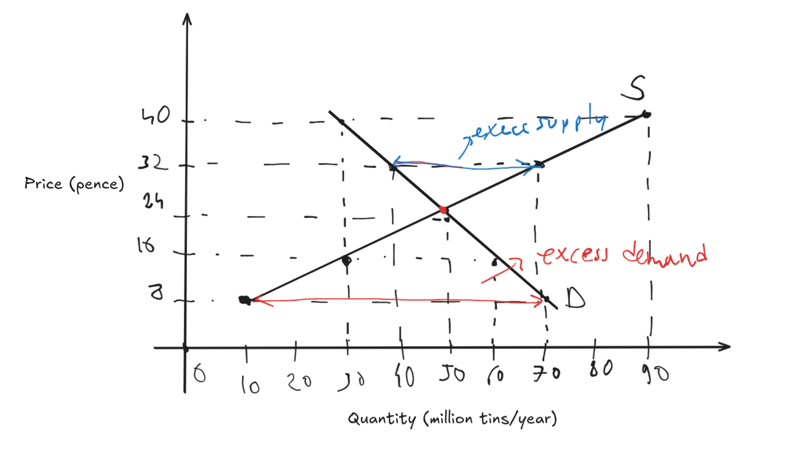
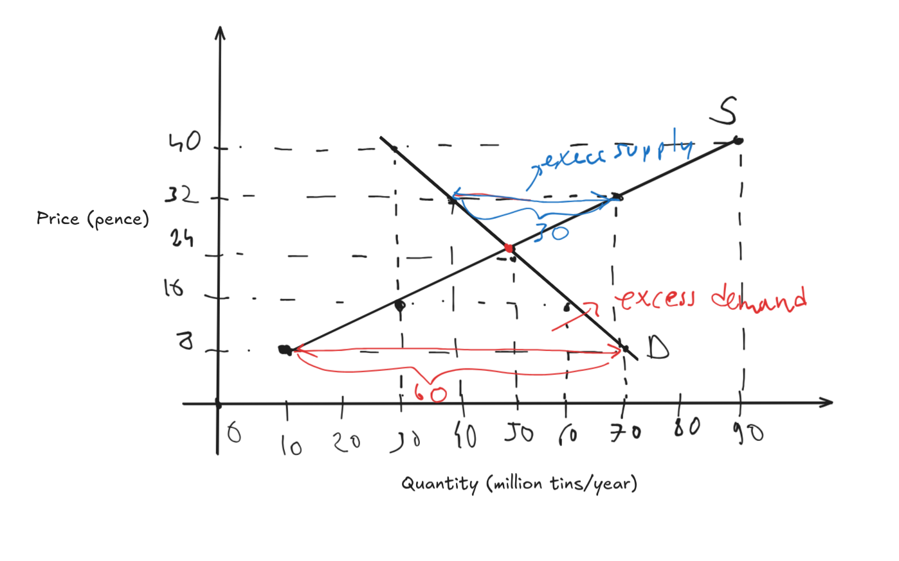
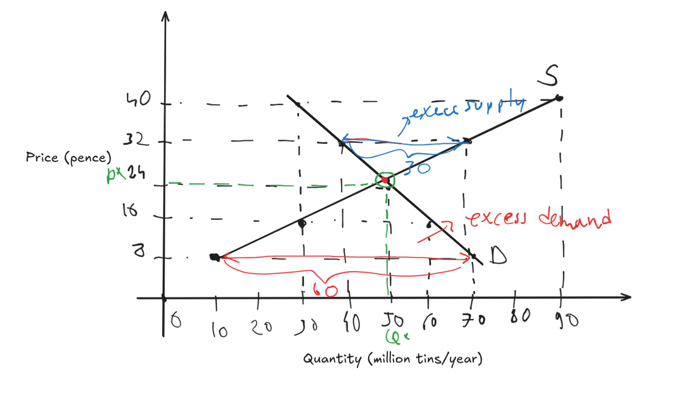
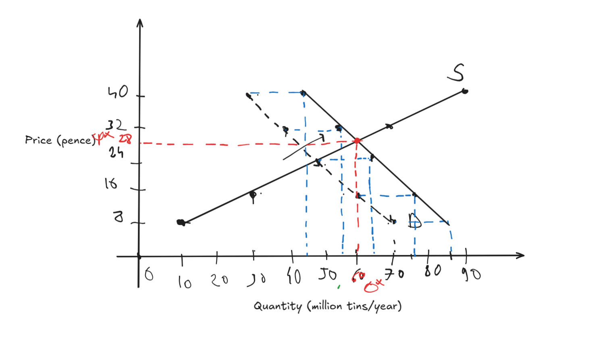

# 1
a.

b.
$|Q_d(8)-Q_s(8)|=70-10=60$ million tins/year.

c.
$|Q_d(32)-Q_s(32)|=70-40=30$ million tins/year.

Complete

d.
$P^* = 24$p
$Q^* = Q_d(P^*)=Q_s(P^*)=50$ million tins/year.

e.
$Q_d(P)-15=-10/8(P-64)$
$Q_s(P)=20/8(P-4)$
$Q_d(P)=Q_s(P) \implies P=840/30=28$ p
$Q_d(28)=20/8(28-4)=60$ million tins/year

# 7
S - Substitutes  C - Complements  D - Depens (Should be measured)
(a) S
(b) C
(c ) D - No idea how they can be correlated. Maybe you buy icecreams when you wait to fill your petrol.
(d) C
(e) D - If I have to chose then C cause after eating beef you eat icecrem as desert
(f) D - If I have to chose then C cause usally in bus journeies people buy a lot of icecream to refresh themselfs.
(g) D - No idea how they can be correlated.

# 8
We have a minimum price =>
a. $P_2$ $Q_3$ The market equilibrium
b. $P_1$because $P_2<P_1$ and $P_1$ is min so the price can't go down.
c. $Q_1$ 
d. $|Q_1-Q_4|$
e. $P_2$ because $P_2>P_3$and $P_3$ is min so the market will tend to the equilibrium
f. $Q_3$
g. None
