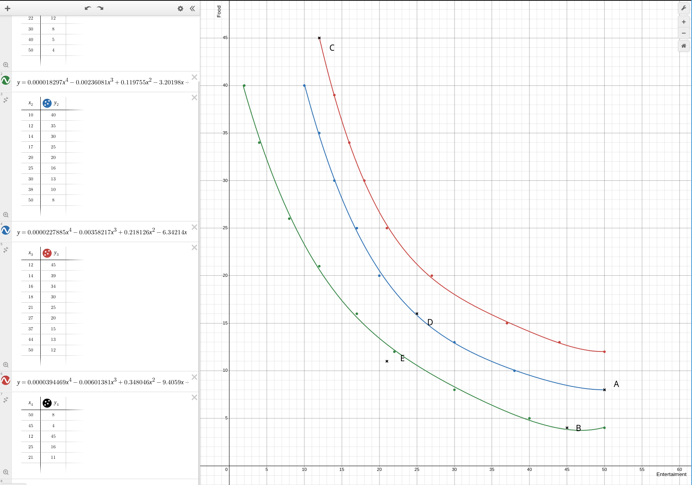
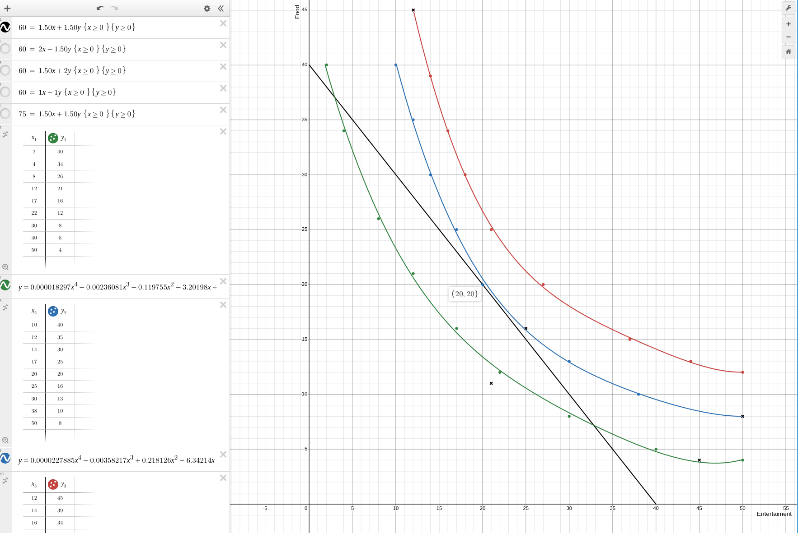

# Homework 4 ~Klevis Imeri T4XGKO~

## 1
Both (d) and (e) result in budget lines parallel compared to (a) but shifted outward (increased purchasing power).
This is because:
    - (d) shifts outward due to lower prices (both reduced to £1). $I/P=60/1.5=40<60=60/1=I/P^{'}$. So the intercepts move from 40 to 60.
    - (e) shifts outward due to a higher allowance (from £60 to £75). $I/P=60/1.5=40<50=75/1.5=I/P^{'}$. So intercepts moving from 40 to 50.
So for both (d) and (e) lines we have a outward shift indicating a increase of purchsing power but for different reasons. 
In (d) because the prices went down and in (e) becuse the allowance went up.

## 2

a) I tried to fit the curves using regression, I could have also drawn them by hand but I think they fitted good enough.

b) IC3 (red) because the more items you have the more the curve is into the right and top and the curves can not cross.
c) IC1 (green) the oppsite reason from above.
d) C A D B E or C D A B E.  
- C firt because its on the highets utility curve.
- A and D are in the same line so they are interchangable
- B is on green after A and D on blue.
- E is below green therefore last becuase utility curves don't intersect.

e) We need the buget line without it we can't find Ashley's optimal choice point.
And it si not given in this exercise.
f) The regression is a bit impresice but you can see the the point (20,20) belongs both
to the utility curve and to the budget line.

The consumtion bundle that maximizes utility is 20(E) 20(F).

> Note: If you wan to look at the graphs they are here https://www.desmos.com/calculator/jxvjmctbhw

## 3
d is false because it does not represt the most `favourable` relative prices because that is determined by the market itelf. All the other ones are true.

## 4
1. d
2. c
3. a
4. e
5. b
6. f

## 5
a. Perperndicular to $BL_1$
b. Good Y is normal because with budges increase your optimal point says to buy more of this product.
Good X is inferior because with the budges increase your optimal points says to buy less of this product.

d. No because as mentioed above shifting in the direction x=y parallel wit the budget line it increases your utility. 
Threfore, one fo the good has to get more utility or it can be distributed ⟹ you can't depinct two inferior good.

