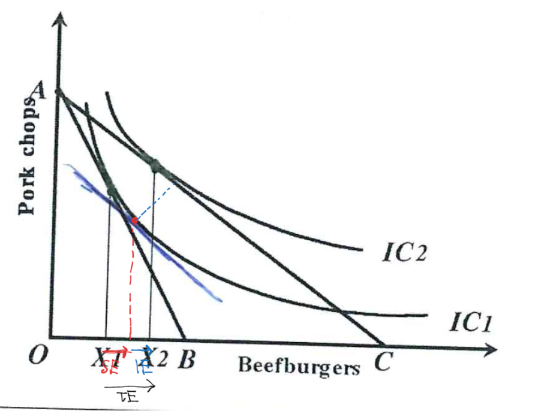
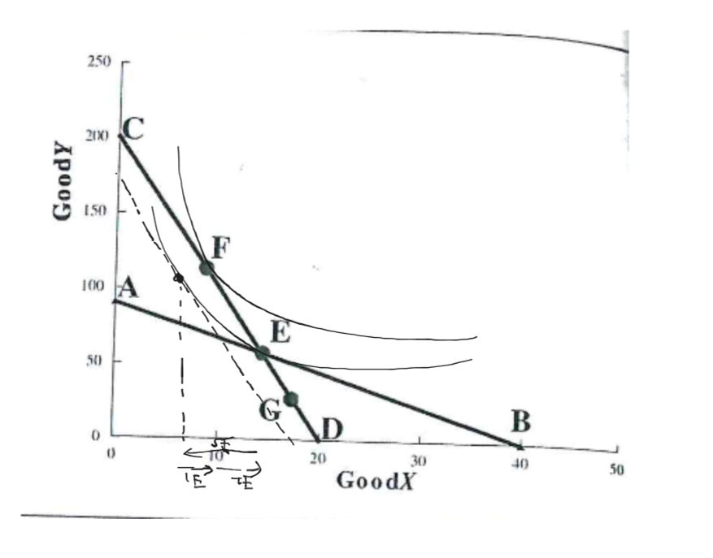
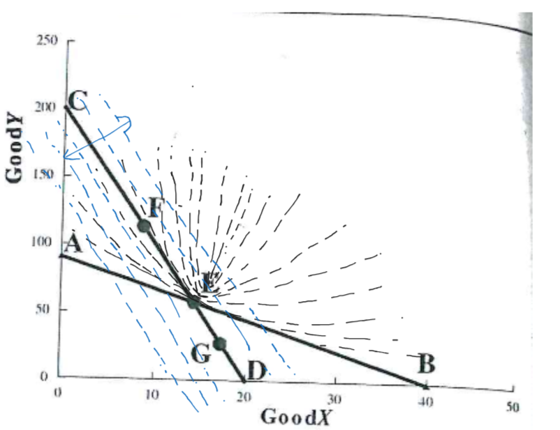
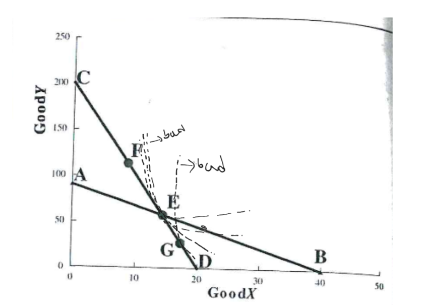
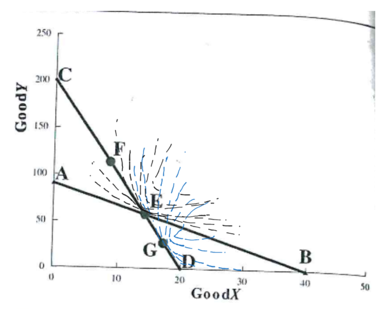

# Homework5

## 3
- a. Valid. To maximaze your utility is the same as choosing the highest indifference curve because a higher 
indifference curve has higher uitility be definition.
- b. Valid, as points to the left of the budget line imply unspent income, which contradicts utility maximization (under standard assumptions, you my want to save?).
- c. Valid, as combinations beyond the budget line are unaffordable.
- d. Invalid, The consumer doesn't choose the relative prices. They are given by the market. The consumer can only change the quantity bought for each product.
- e. Valid, as all other points on the budget line lie on lower indifference curves.
(Under standard assumption, where preferences are convex and indifference curves are strictly convex to the origin.
If you have weirdly shaped curves you can have 2 tanget points)

## 8
a.

Substitution effect : red
Real Income effect : blue

b. Beefburgers are a normal good.
The income effect leads to increased consumption of beefburgers as real income rises.
In other words the income effect is in the same direction as the substitution effect.
c. They reinforce each other.
d. The oppsite would be the case if you have an inferior good or a giffen good (incase of Beefburgers)

## 9
a.
Yes. The substitution effect (due to cheaper Y) pushes Eliot to consume more Y and less X.
Example:

b.
No. Price of Y went up and price of X went down so you will demand more of Y then X ⟹ SE is always poting to the left as seen in the illustartion above and below. Now the only way you can reach point D is if your IE is bigger then SE and pointing the right in apposite dirrection => you have to have a giffen good.
If we look at it visually becuase E was our optimum and E is both part of AB and CD line it restrcits our IC curves in such a way that a giffen good of this kind can not exits else point E should be in every IC curve. The idea of the prof is that if you wanted to reach the right part of IC (from E to the right) then the left part of IC from E should be above the curve (under standart assumtion as mentioned above), but this can only hapeen if the curves intersect.

> In short words all the curves CD is tangent at point G intersect the curves where AB is tangent at E as shown below.

From here you can even see that F has points which do not intersect some IC curves at E.

c. In the CE section.
