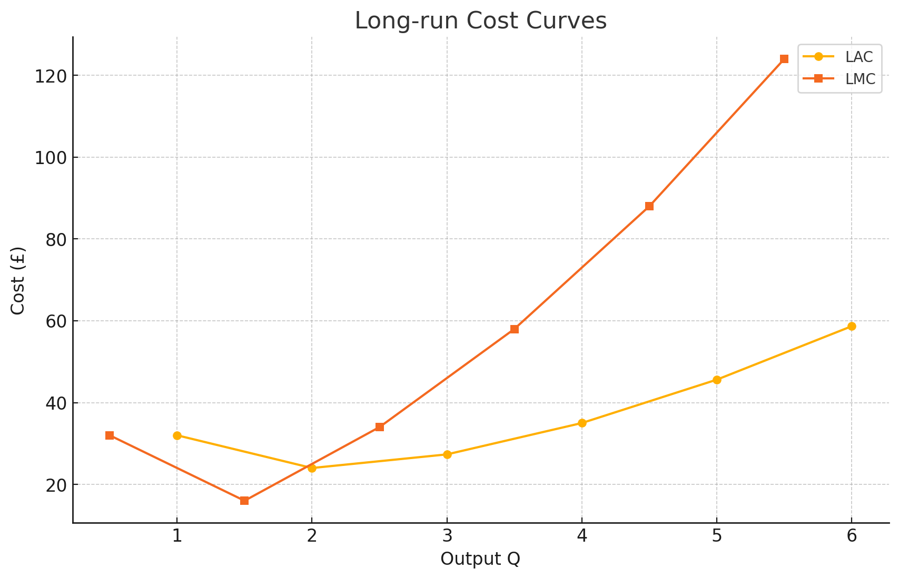

### HOMEWORK7

1)

a & b) Total cost at £200 L, £400 K & best technique
| Q | A      | B      | C      | Min-cost |
| - | ------ | ------ | ------ | :------: |
| 1 | 2 600  | 2 800  | 3 200  |     A    |
| 2 | 5 000  | 5 200  | 5 600  |     A    |
| 3 | 7 400  | 7 600  | 8 000  |     A    |
| 4 | 10 200 | 10 000 | 10 800 |     B    |
| 5 | 14 200 | 13 600 | 14 000 |     B    |
| 6 | 19 800 | 18 200 | 17 600 |     C    |
| 7 | 27 200 | 24 200 | 21 800 |     C    |

c) Rising £/L makes labour-saving (more-K) methods relatively cheaper, so the firm will shift toward techniques with lower L/K ratios.
d) Total cost at £300 L, £400 K & best technique 
| Q | A      | B      | C      |   Min-cost   |
| - | ------ | ------ | ------ | :----------: |
| 1 | 3 500  | 3 400  | 3 600  |       B      |
| 2 | 6 900  | 6 200  | 6 400  |       B      |
| 3 | 10 300 | 9 000  | 9 200  |       B      |
| 4 | 14 300 | 11 800 | 12 400 |       B      |
| 5 | 20 100 | 16 000 | 16 000 | B or C (tie) |
| 6 | 28 300 | 21 500 | 20 000 |       C      |
| 7 | 39 200 | 28 700 | 24 700 |       C      |

2)

a)
- Long-run average cost (LAC) = TC / Q
- Long-run marginal cost (LMC) = ΔTC / ΔQ

|  Q  | TC (£) | LAC (£) | LMC (£) |
| :-: | -----: | -------: | ------: |
|  0  |      0 |        – |       – |
|  1  |     32 |    32.00 |      32 |
|  2  |     48 |    24.00 |      16 |
|  3  |     82 |    27.33 |      34 |
|  4  |    140 |    35.00 |      58 |
|  5  |    228 |    45.60 |      88 |
|  6  |    352 |    58.67 |     124 |

b)

c) LAC is minimal at Q = 2 units of output.
d) LMC equals LAC at Q = 2 (the curves intersect there). 

3)
a) Economies of scale where LAC is falling: Q = 1 → 2.
b) Diseconomies of scale where LAC is rising: Q = 2 → 6.
c) Minimum efficient scale (output that achieves lowest LAC): Q = 2.
d) At the LAC minimum, the firm operates at constant returns to scale (the curve is momentarily horizontal)—here a proportionate increase in all inputs yields the same proportionate increase in output, and LMC = LAC.

Proof LMC = LAC:
Let total cost be $TC(Q)$. Define average cost

$$
AC(Q) = \frac{TC(Q)}{Q}.
$$

The marginal cost is

$$
MC(Q) = \frac{d\,TC}{dQ}.
$$

Differentiate $AC(Q)$ with respect to $Q$:

$$
\frac{d\,AC}{dQ}
= \frac{Q\;\frac{d\,TC}{dQ} \;-\; TC(Q)\;\frac{d\,Q}{dQ}}{Q^2}
= \frac{Q\;MC(Q) \;-\; TC(Q)}{Q^2}.
$$

At a minimum of $AC(Q)$, $\tfrac{d\,AC}{dQ}=0$, so

$$
Q\;MC(Q) \;-\; TC(Q) \;=\;0
\quad\Longrightarrow\quad
MC(Q) \;=\;\frac{TC(Q)}{Q}\;=\;AC(Q).
$$

Thus mathematically the MC curve must equal AC exactly where AC is minimized.
