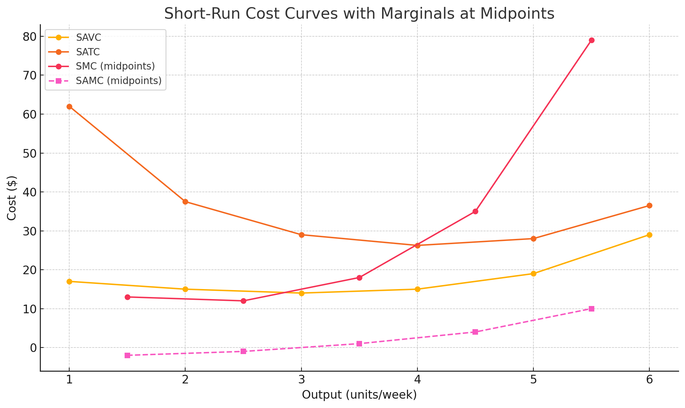
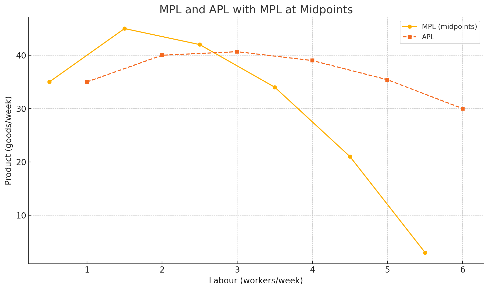

# Homework8

### 6
a)
- SAFC = 45/Q
- SATC = SAVC + SAFC
- TC = SRATC*Q = (SAVC·Q) + 45
- SMC = ΔTC/ΔQ

| Output (Q) | SAVC | SAFC | SATC |  TC | SMC |
|------------|------|------|------|-----|-----|
| 1          | 17   | 45.0 | 62.0 | 62  |  -  |
| 2          | 15   | 22.5 | 37.5 | 75  | 13  |
| 3          | 14   | 15.0 | 29.0 | 87  | 12  |
| 4          | 15   | 11.25| 26.25 | 105 | 18  |
| 5          | 19   | 9.0  | 28.0 | 140 | 35  |
| 6          | 29   | 7.5  | 36.5 | 219 | 79  |

b) Well they definitly ment SMC and not SAMC. Eitherway I included SAMC.

The plotted curves show that SMC intersects the minima of SAVC (at Q=3) and SATC (around Q=4).

c) Going from 5→6 units, MC spikes because each extra worker adds very little output 
(diminishing marginal product of labor), so you must hire much more labor (higher variable cost) 
to get that extra unit.

### 7
a)
| Labour (workers/week) | Output (goods/week) | MPL  | APL   |
|-----------------------|---------------------|------|-------|
| 0                     | 0                   | —    | —     |
| 1                     | 35                  | 35   | 35.00 |
| 2                     | 80                  | 45   | 40.00 |
| 3                     | 122                 | 42   | 40.67 |
| 4                     | 156                 | 34   | 39.00 |
| 5                     | 177                 | 21   | 35.40 |
| 6                     | 180                 | 3    | 30.00 |

b)

c) Between 1 and 2 level of laber input. The peeak of MPL curve.

d) Very close to 3 so lets approximate to 3 which is also the peek of APL.
Proof APL==MPL at the maxima of APL.
$$
\frac{d}{dL}\bigl(\mathrm{APL}\bigr)=0.
$$

Since

$$
\mathrm{APL}(L)=\frac{Q(L)}{L},
$$

we have

$$
\frac{d}{dL}\Bigl(\tfrac{Q(L)}{L}\Bigr)
=\frac{L\,Q'(L)\;-\;Q(L)}{L^2}
=\frac{L\;\mathrm{MPL}(L)\;-\;Q(L)}{L^2}.
$$

Setting this to zero gives

$$
L\cdot\mathrm{MPL}(L)-Q(L)=0
\quad\Longrightarrow\quad
\mathrm{MPL}(L)=\frac{Q(L)}{L}=\mathrm{APL}(L).
$$

e) If workers have more place to work, machinery and better equiped, in other words
the capital input is higher then:
- The same workers with better tools can now produce more so adding one more workers can bring more => MPL shift upwards 
- If you have more empty tools for workers to work with then more workers its propabaly more efficient (higher APL). => MPL shift right

=> a shift to the right of the APL peek 

$$Q=F(L,K)$$
$$Q'=F(L,K+c)=F(L,K)f_k(c)$$
If $f_k(c)=const$ =>  then you only have a shift  up and the peek does not shift to the right for MPL.

$$
MPL'(L)\;=\;\frac{dQ'}{dL}
=\frac{d}{dL}\bigl[f_k(c)\,F(L,K)\bigr]
=f_k(c)\,\frac{\partial F(L,K)}{\partial L}
=f_k(c)\,MPL(L).
$$

Since $f_k(c)$ is just a positive constant multiplier, the location $L^*$ that maximizes $MPL'(L)$ satisfies

$$
L^*=\arg\max_L\bigl[f_k(c),MPL(L)\bigr]
=\arg\max_LMPL(L),
$$

so the peak of the MPL curve remains at the same $L^*$.
