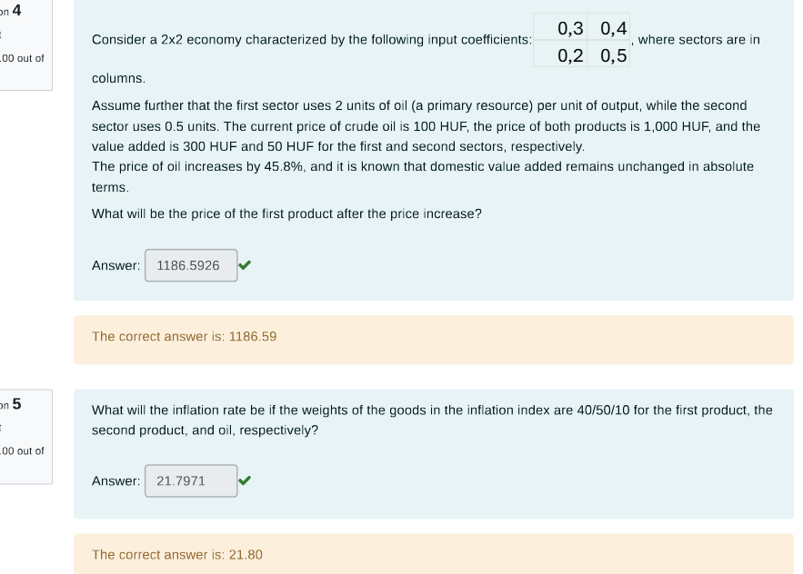

Of course. Here is a step-by-step solution to both problems using matrices and vectors as requested.

### **Problem 4: Calculating the New Price of the First Product**

This problem can be solved using the Leontief price model. The model states that the price of a product must cover the cost of its inputs (both intermediate and primary) plus the value added.

#### 1. Define the Vectors and Matrices

From the problem description, we can define the following:

*   **Input-Output Matrix (A):** This matrix shows the amount of input from sector *i* (row) needed to produce one unit of output in sector *j* (column).
    ```
    A = | 0.3  0.4 |
        | 0.2  0.5 |
    ```
*   **Initial Price Vector (P):** The initial prices of the two products.
    `P = [1000, 1000]`
*   **Oil Input Coefficients (a_oil):** A vector representing the units of oil needed per unit of output for each sector.
    `a_oil = [2, 0.5]`
*   **Initial Oil Price (P_oil):**
    `P_oil = 100` HUF
*   **Value Added Vector (v):** The value added per unit of output for each sector.
    `v = [300, 50]`

#### 2. The Leontief Price Equation

The price equation for an economy is:
**`p = Aᵀp + c`**

Where:
*   **p** is the column vector of product prices.
*   **Aᵀ** is the transpose of the input-output matrix.
*   **c** is the column vector of costs per unit of output, excluding intermediate inputs. This vector is the sum of primary input costs and value added.

Let's calculate the initial cost vector `c_initial`:
**`c = (a_oil)ᵀ * P_oil + vᵀ`**
`c_initial = [2, 0.5]ᵀ * 100 + [300, 50]ᵀ`
`c_initial = [200, 50]ᵀ + [300, 50]ᵀ = [500, 100]ᵀ`

We can verify that the initial prices are correct: `p = (I - Aᵀ)⁻¹ * c`
Let's first calculate `(I - Aᵀ)`:
`I - Aᵀ = | 1  0 | - | 0.3  0.2 | = | 0.7  -0.2 |`
`          | 0  1 |   | 0.4  0.5 |   | -0.4  0.5 |`
The inverse, `(I - Aᵀ)⁻¹`, is `(1/det) * adj(matrix)`:
`det = (0.7 * 0.5) - (-0.2 * -0.4) = 0.35 - 0.08 = 0.27`
`(I - Aᵀ)⁻¹ = (1/0.27) * | 0.5  0.2 |`
`                      | 0.4  0.7 |`

`p_initial = (1/0.27) * | 0.5  0.2 | * | 500 | = (1/0.27) * | 250 + 20 | = (1/0.27) * | 270 | = | 1000 |`
`                      | 0.4  0.7 |   | 100 |            | 200 + 70 |            | 270 |   | 1000 |`
The initial state is consistent.

#### 3. Calculate the New Prices (p')

The price of oil increases by 45.8%, and the value added remains constant.

*   **New Oil Price (P'_oil):**
    `P'_oil = 100 * (1 + 0.458) = 145.8` HUF
*   **New Cost Vector (c'):** The value added `v` is unchanged.
    **`c' = (a_oil)ᵀ * P'_oil + vᵀ`**
    `c' = [2, 0.5]ᵀ * 145.8 + [300, 50]ᵀ`
    `c' = [291.6, 72.9]ᵀ + [300, 50]ᵀ = [591.6, 122.9]ᵀ`

Now, we solve for the new price vector `p'`:
**`p' = (I - Aᵀ)⁻¹ * c'`**
`p' = (1/0.27) * | 0.5  0.2 | * | 591.6 |`
`               | 0.4  0.7 |   | 122.9 |`

First, perform the matrix-vector multiplication:
`| (0.5 * 591.6) + (0.2 * 122.9) | = | 295.8 + 24.58 | = | 320.38 |`
`| (0.4 * 591.6) + (0.7 * 122.9) |   | 236.64 + 86.03 |   | 322.67 |`

Now, multiply by `1/0.27`:
`p' = (1/0.27) * | 320.38 | = | 320.38 / 0.27 | = | 1186.5926 |`
`               | 322.67 |   | 322.67 / 0.27 |   | 1195.0741 |`

The new price vector is `p' = [1186.59, 1195.07]`.

**Answer for Question 4:** The price of the first product after the price increase is **1186.59** HUF.

---

### **Problem 5: Calculating the Inflation Rate**

The inflation rate is the weighted average of the price changes for the goods in the index.

#### 1. Define the Weights and Prices

*   **Weights Vector (w):** For the first product, second product, and oil.
    `w = [0.4, 0.5, 0.1]`
*   **Initial Price Vector (P_basket_initial):**
    `P_basket_initial = [P1, P2, P_oil] = [1000, 1000, 100]`
*   **New Price Vector (P_basket_new):**
    `P_basket_new = [P1', P2', P'_oil] = [1186.59, 1195.07, 145.8]`

#### 2. Calculate Individual Price Changes

First, we calculate the percentage price change for each item in the basket.
*   **% Change in P1:** `(1186.59 / 1000 - 1) * 100 = 18.659%`
*   **% Change in P2:** `(1195.07 / 1000 - 1) * 100 = 19.507%`
*   **% Change in P_oil:** `(145.8 / 100 - 1) * 100 = 45.8%`

#### 3. Calculate the Weighted Average Inflation Rate

The overall inflation rate is the dot product of the weights vector and the vector of percentage changes.

**`Inflation Rate = w ⋅ [%ΔP1, %ΔP2, %ΔP_oil]ᵀ`**
`Inflation Rate = (0.4 * 18.659) + (0.5 * 19.507) + (0.1 * 45.8)`
`Inflation Rate = 7.4636 + 9.7535 + 4.58`
`Inflation Rate = 21.7971 %`

**Answer for Question 5:** The inflation rate is **21.80%**.
