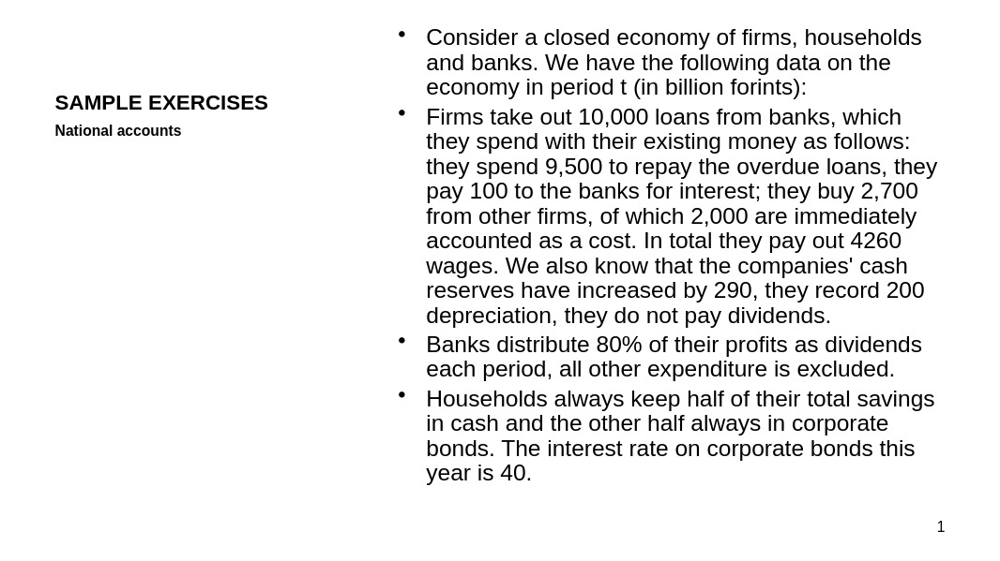
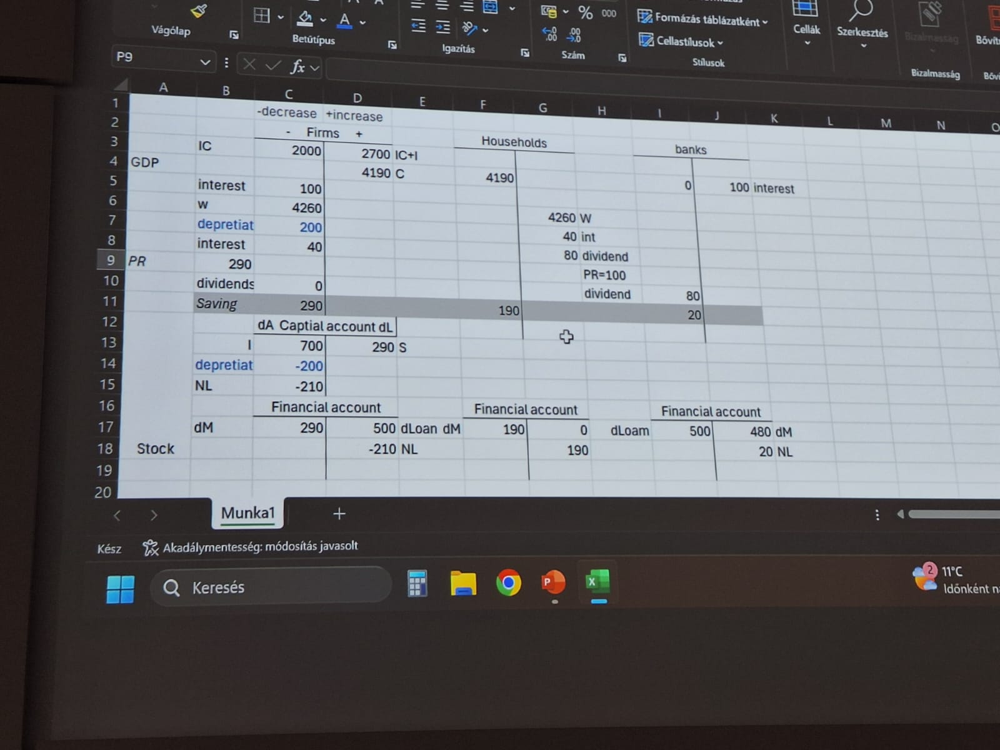
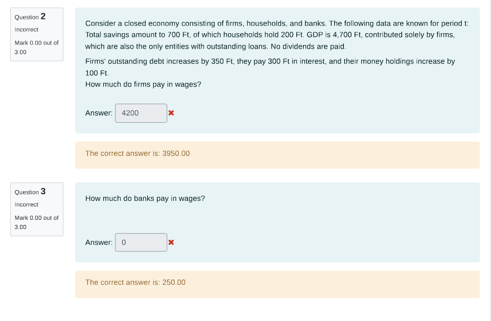

Example:

Solution:

Example:

Of course! Let's break down these problems step-by-step using macroeconomic accounting principles. The user-provided hint has the right ideas but is a bit jumbled. We'll organize it into a clear, logical flow for each question.

The core principle here is that for any sector (firms, banks, households) and for the economy as a whole, the **Sources of Funds** must equal the **Uses of Funds**.

### Given Information from the Problem:

*   **Sectors:** Firms, Households, Banks (Closed Economy)
*   **Total Savings (S_total):** 700
*   **Household Savings (S_h):** 200 (The portion of total savings held by households)
*   **GDP:** 4,700 (Contributed solely by firms)
*   **Firms' Change in Debt (ΔL_f):** +350 (Increase in outstanding debt)
*   **Firms' Interest Paid (Int_f):** 300
*   **Firms' Change in Money Holdings (ΔM_f):** +100 (Increase in money holdings)
*   **Dividends:** 0

---

### Question 2: How much do firms pay in wages?

**Correct Answer:** 3950.00

**Method: Analyzing the Firms' Sources and Uses of Funds**

We can think of the firm's operations during period 't' as a flow of funds.

**1. Identify the Firms' Sources of Funds (Money In):**
*   **Revenue from Sales:** The problem states GDP is contributed solely by firms, so their total revenue is the GDP.
    *   Revenue = 4,700
*   **New Borrowing:** Firms increased their debt, which is a source of new cash for them.
    *   Increase in Debt (ΔL_f) = 350
*   **Total Sources = 4,700 + 350 = 5,050**

**2. Identify the Firms' Uses of Funds (Money Out):**
*   **Wages Paid (W_f):** This is the value we need to find.
*   **Interest Paid (Int_f):** Given as 300.
*   **Investment (I):** In a closed economy, **Total Savings = Total Investment**. Since S_total = 700, then Total Investment (I) = 700. In this simple model, firms are the only ones who perform capital investment.
    *   Investment (I) = 700
*   **Increase in Money Holdings (ΔM_f):** Firms increased their cash reserves. This is a use of funds.
    *   Increase in Money (ΔM_f) = 100
*   **Total Uses = W_f + 300 + 700 + 100**

**3. Set Sources Equal to Uses and Solve for Wages (W_f):**
Sources = Uses
5,050 = W_f + 300 + 700 + 100
5,050 = W_f + 1,100
W_f = 5,050 - 1,100
**W_f = 3,950**

This matches the correct answer.

***

### Question 3: How much do banks pay in wages?

**Correct Answer:** 250.00

**Method: Analyzing Sectoral Savings**

To find the banks' wages, we first need to figure out the banks' profits (which are their savings). We can do this by breaking down the economy's total savings.

**1. Find Firms' Savings (S_f):**
*   A firm's saving is its retained profit.
*   Savings = Revenue - Expenses
*   S_f = GDP - Wages Paid - Interest Paid
*   S_f = 4,700 - 3,950 (from Q2) - 300
*   **S_f = 450**

**2. Use the Total Savings Identity to find Banks' Savings (S_b):**
*   Total Savings in the economy is the sum of savings from all sectors.
*   S_total = Savings_Households (S_h) + Savings_Firms (S_f) + Savings_Banks (S_b)
*   We are given S_total = 700 and S_h = 200. We just calculated S_f = 450.
*   700 = 200 + 450 + S_b
*   700 = 650 + S_b
*   **S_b = 50**

**3. Use the Bank's Profit/Savings Formula to find Bank Wages (W_b):**
*   A bank's profit (its savings) is its revenue minus its costs.
*   **Bank Revenue:** The only source of revenue for the bank mentioned is the interest paid by firms.
    *   Interest Received = 300
*   **Bank Costs:** The only cost for the bank mentioned is wages.
    *   Wages Paid = W_b (This is what we need to find)
*   Now, set up the equation for bank savings:
*   S_b = Interest Received - Wages Paid
*   50 = 300 - W_b
*   W_b = 300 - 50
*   **W_b = 250**

This matches the correct answer.
