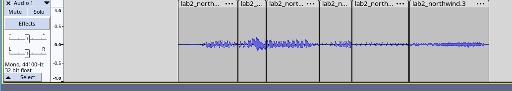
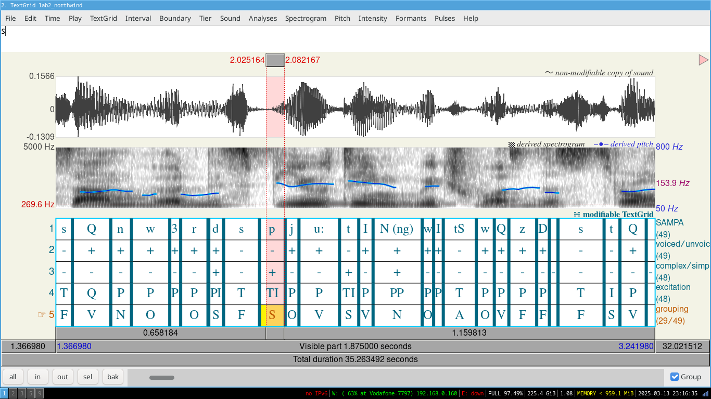

Speech Information Systems – Lab 3

# Speech processing

## Preparations

Download the audio sample to be used during the lab, then listen to the entire recording once: <https://lsa.tmit.bme.hu/files/sis/lab2_northwind.wav>

Open the following website in a new window: <https://en.wikipedia.org/wiki/X-SAMPA> and briefly study it.

## Manual word concatenation from sounds

Cut out sounds from the downloaded recording and try to cut your own first name from it! (If your first name is too long or too short, choose a first name consisting of 5-7 sounds.) You can use the Audacity program to complete the task, for example.

Save the created audio file as &lt;neptun code&gt;.wav, in wav format, using a mono channel, a sampling frequency of 16 kHz, and 16-bit PCM encoding.

## Segmentation and annotation

Segment and annotate the following section of the recording at phoneme level using the praat program: “The North Wind and the Sun were disputing, which was the stronger, when a traveler came along wrapped in a warm cloak. They agreed that the one who first succeeded in making the traveler take his cloak off should be considered stronger than the other.”

Add the following rows (tiers) to the annotation:

- SAMPA notation
  - mark the sound with the SAMPA character.
- voiced/unvoiced
  - put “+” if the sound is voiced, and “-” if the sound is unvoiced.
- complex in time / simple in time
  - mark it with “+” if the sound is time-complex, and with “-” if the sound is not complex.
- excitation type (voicing/noise/mixed)
  - specify the type of excitation (P: quasi-periodic excitation (voicing), I: impulse (shock wave) excitation, T: turbulent airflow excitation(noises)). _Please note that in the case of time-complex sounds, several excitations may be present at the same time, in which case the sound is segmented and annotated by excitation type in the given tier!_
- sound grouping
  - Indicate the sound group the given sound belongs to (V: vowel, N: nasal, S: stop, A: affricate, F: fricative, O: other consonant)

Save the completed TextGrid file as &lt;neptun code&gt;.TextGrid.

